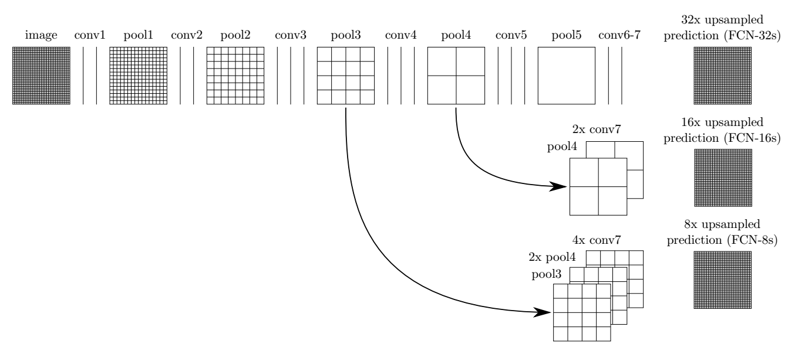

# Semantic Segmentation
### Introduction
In this project, we'll label the pixels of a road in images using a Fully Convolutional Network (FCN). FCN Netweork is established and trained according to these following steps. 

* A VGG16 model pretrained on ImageNet for classification has been loaded and used as encoder to downsample the input images and extract features. 
* VGG16's fully-connected layer has been replaced by 1-by-1 convolutions in order to preserve spatial information. 
* Then we'll upsample the input to the original image size and add two skip connections to retain some lost information during encodering process. 
* Kitti Road dataset has been used to train FCN model.
* AWS EC2 AMI has been used as GPU calcualtion tool to finish this project. 
### Summary
There are some sample images shown below including original, gound truth and images output from FCN model.  

Original | Output of FCN
---------|--------------
 |   

* These functions `load_vgg`, `layers`, `optimize` and `train_nn` have been implemented. 
* The loss of FCN has been printed during training process. 
* On average, the model decreases loss over time.
* The number of epoch and batch size are set to a reasonable number.
* The project labels most pixels of roads close to the best solution.

Most of time has been spent on AWS and development enviroment. There are still a lot of potential space and possibilities to optimize and expand FCN model usage. 

There are some poor sample images shown below also.

Original | Output of FCN
---------|--------------
 |   
### FCN Architecture
There are 3 componets including Pre-Trianed encoder model, 1x1 convolution and Transpose convolution.  
Detail FCN architecture can refer to the following image.



### Hyperparameters
There are several hyperparameters shown below which influence model and loss greatly and need more time to try and optimize:
* Learning rate
* Dropout
* Epochs
* Batch size
* Standard deviation of convolution layer initializer

Standard deviation of convolution layer initializer is a major influence factor for FCN model cost. If ingore Standard deviation of convolution layer initializer in model, the finally model loss is relative higher. 

Some time has been spent on parameter optimization but not enough to get the best results. A primay acceptable hyperparamers has been used in model and shown below. 
* Learning rate = 0.0001
* Dropout = 0.5
* Epochs = 50
* Batch size = 4
* Standard deviation of convolution layer initializer = 0.01

The train cost history is shown below. It is obvious that cost still vibrate with increasement of epoch. 

Epoch       | Loss           
------------|--------------
Epoch: 0/50 | Loss: 0.19126196205615997
Epoch: 1/50 | Loss: 0.09253666549921036
Epoch: 2/50 | Loss: 0.16781090199947357
Epoch: 3/50 | Loss: 0.08838869631290436
Epoch: 4/50 | Loss: 0.040463902056217194
Epoch: 5/50 | Loss: 0.1356467604637146
Epoch: 6/50 | Loss: 0.06281384080648422
Epoch: 7/50 | Loss: 0.025621946901082993
Epoch: 8/50 | Loss: 0.021101318299770355
Epoch: 9/50 | Loss: 0.05353505536913872
Epoch: 10/50 | Loss: 0.06059085205197334
Epoch: 11/50 | Loss: 0.06396651268005371
Epoch: 12/50 | Loss: 0.03928230702877045
Epoch: 13/50 | Loss: 0.14263874292373657
Epoch: 14/50 | Loss: 0.08465834707021713
Epoch: 15/50 | Loss: 0.04632534459233284
Epoch: 16/50 | Loss: 0.03270598128437996
Epoch: 17/50 | Loss: 0.02292594499886036
Epoch: 18/50 | Loss: 0.021025151014328003
Epoch: 19/50 | Loss: 0.015626100823283195
Epoch: 20/50 | Loss: 0.018531711772084236
Epoch: 21/50 | Loss: 0.09399053454399109
Epoch: 22/50 | Loss: 0.014015669003129005
Epoch: 23/50 | Loss: 0.032019972801208496
Epoch: 24/50 | Loss: 0.04006418585777283
Epoch: 25/50 | Loss: 0.019357703626155853
Epoch: 26/50 | Loss: 0.014407360926270485
Epoch: 27/50 | Loss: 0.02987801283597946
Epoch: 28/50 | Loss: 0.010609107092022896
Epoch: 29/50 | Loss: 0.008342158980667591
Epoch: 30/50 | Loss: 0.02439144253730774
Epoch: 31/50 | Loss: 0.008711332455277443
Epoch: 32/50 | Loss: 0.020091453567147255
Epoch: 33/50 | Loss: 0.008981340564787388
Epoch: 34/50 | Loss: 0.026787733659148216
Epoch: 35/50 | Loss: 0.027059877291321754
Epoch: 36/50 | Loss: 0.008333043195307255
Epoch: 37/50 | Loss: 0.038029152899980545
Epoch: 38/50 | Loss: 0.008580551482737064
Epoch: 39/50 | Loss: 0.020091751590371132
Epoch: 40/50 | Loss: 0.01240622904151678
Epoch: 41/50 | Loss: 0.021169977262616158
Epoch: 42/50 | Loss: 0.014455596916377544
Epoch: 43/50 | Loss: 0.09582272917032242
Epoch: 44/50 | Loss: 0.04804961383342743
Epoch: 45/50 | Loss: 0.02308090403676033
Epoch: 46/50 | Loss: 0.01742571033537388
Epoch: 47/50 | Loss: 0.008586134761571884
Epoch: 48/50 | Loss: 0.029022736474871635
Epoch: 49/50 | Loss: 0.011340917088091373


### Tools
#### AWS EC2
AWS EC2 AMI g3.4xlarge need apply seperately and wait for amazon approval. 
Class "AWS GPU instances" and "Lenet on AWS" in term1 class "Traffic Sign Classifer" are useful for fresh user of AWS. 

#### Jupyter notebook
Please refer to [this link](https://medium.com/@GalarnykMichael/aws-ec2-part-4-starting-a-jupyter-ipython-notebook-server-on-aws-549d87a55ba9) to use jupyter on AWS instances. 

1. Set password using IPython
2. openssl
3. Update jupyter_notebook_config.py
4. Access https://ip-address:port/ by command `jupyter notebook`

#### Putty and WinSCP
Putty is a important software for you connect windows to AWS instances. 
WinSCP can transfer files between your local windows PC and AWS instances. 

Please refer to [AWS doc](https://docs.aws.amazon.com/AWSEC2/latest/UserGuide/putty.html?icmpid=docs_ec2_console)
1. Download software
2. Generate ppk using PuTTYgen
3. Connect AWS instances using Putty
4. Connect AWS instance using WinSCP

### Setup
##### Frameworks and Packages
Make sure you have the following is installed:
 - [Python 3](https://www.python.org/)
 - [TensorFlow](https://www.tensorflow.org/)
 - [NumPy](http://www.numpy.org/)
 - [SciPy](https://www.scipy.org/)
##### Dataset
Download the [Kitti Road dataset](http://www.cvlibs.net/datasets/kitti/eval_road.php) from [here](http://www.cvlibs.net/download.php?file=data_road.zip).  Extract the dataset in the `data` folder.  This will create the folder `data_road` with all the training a test images.

### Start
##### Implement
Implement the code in the `main.py` module indicated by the "TODO" comments.
The comments indicated with "OPTIONAL" tag are not required to complete.
##### Run
Run the following command to run the project:
```
python main.py
```
**Note** If running this in Jupyter Notebook system messages, such as those regarding test status, may appear in the terminal rather than the notebook.

### Submission
1. Ensure you've passed all the unit tests.
2. Ensure you pass all points on [the rubric](https://review.udacity.com/#!/rubrics/989/view).
3. Submit the following in a zip file.
 - `helper.py`
 - `main.py`
 - `project_tests.py`
 - Newest inference images from `runs` folder
 
 ## How to write a README
A well written README file can enhance your project and portfolio.  Develop your abilities to create professional README files by completing [this free course](https://www.udacity.com/course/writing-readmes--ud777).
